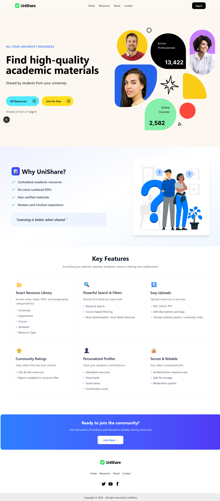
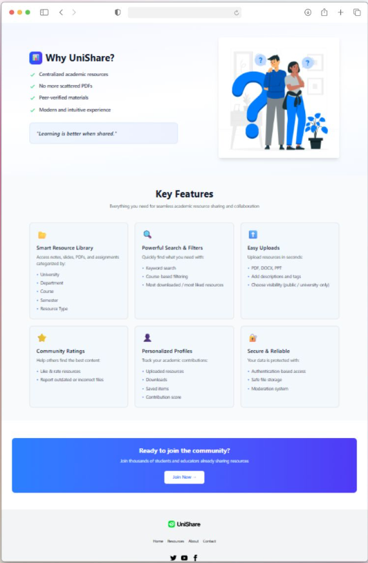

# 🎓 UniShare

  
  
  
  

  A secure full-stack university resource-sharing platform built with Next.js, NestJS, PostgreSQL, TypeORM, JWT Authentication, Zod, and TypeScript.

  

---

## 🚀 Project Overview

**UniShare** is a full-stack university resource-sharing platform built to make studying more collaborative, organized, and efficient.

It allows students to browse, download, bookmark, rate, and manage study materials such as:

- PDFs
- PPTs
- Notes
- Useful academic links
- Course-related study resources

The project was built with real-world application practices, focusing on secure authentication, authorization, validation, REST API design, database integration, and clean full-stack architecture.

---

## ✨ Key Features

### 🔐 Authentication & Authorization

- Secure JWT-based authentication
- Role-based access control
- Protected frontend and backend routes
- Student-only access for downloading resources
- Password hashing using bcrypt
- Secure API authorization checks
- Clean login and registration flow

---

### 📚 Resource Management CRUD

UniShare includes complete CRUD functionality for study resources.

#### Create

- Upload new study resources
- Add title, description, category, semester, and resource type
- Add PDFs, PPTs, notes, or useful links

#### Read

- Browse available resources
- Search resources
- Filter by category
- Filter by semester
- Filter by resource type

#### Update

- Edit resource details
- Update ratings
- Update bookmark status
- Modify resource information with authorization

#### Delete

- Securely remove resources
- Authorization checks before deletion
- Prevent unauthorized modifications

---

### ⭐ Interactive Student Features

- Download study materials
- Bookmark favorite resources
- Rate resources
- Review resources
- Track useful materials
- Improve study collaboration

---

### 📊 Real-Time Resource Insights

Each resource can include useful engagement data such as:

- Download count
- Ratings
- Reviews
- Bookmarks
- Resource activity

These insights help students identify the most useful and popular study materials.

---

## 👥 User Roles

UniShare is designed with a role-based access system.

| Role | Access |
|---|---|
| Admin | Manage users and platform data |
| Moderator | Review and approve resources |
| Contributor | Upload and manage study resources |
| Student | Browse, download, bookmark, and rate resources |

---

## 🛠️ Tech Stack

### 🎨 Frontend

  
  
  
  
  
  

### ⚙️ Backend

  
  
  
  
  

### 🗄️ Database & ORM

  
  

### 🧪 Validation & API Testing

  
  
  
  
  

---

## 🔐 Authentication Flow

### 1. Register

Students can create an account using valid credentials. Passwords are securely hashed using **bcrypt** before being stored in the database.

### 2. Login

After successful login, the backend generates a JWT token for authenticated API access.

### 3. Protected Routes

Protected API routes validate the JWT token before allowing access to private resources.

### 4. Role-Based Access

Different actions are restricted based on the user role. For example, only authenticated students can download study resources.

---

## 🗄️ Database Design

The project uses **PostgreSQL** with **TypeORM**.

Main database tables may include:

- `students`
- `users`
- `study_resources`
- `bookmarks`
- `ratings`
- `reviews`
- `downloads
----

## ✅ Validation Strategy

UniShare uses validation on both frontend and backend.

### Frontend Validation

- Zod schema validation
- Form input validation
- Better user feedback
- Prevents invalid requests before reaching the server

### Backend Validation

- DTO-based validation
- `class-validator`
- `class-transformer`
- NestJS validation pipes
- Clean and safe request handling

---

## ⚙️ Error Handling

The backend uses NestJS HTTP Exceptions to return meaningful and consistent API responses.

## 📮 API Testing

All major REST API endpoints were tested and documented using **Postman**.

Tested features include:

- User registration
- User login
- Protected routes
- Resource creation
- Resource update
- Resource deletion
- Download access
- Bookmark system
- Rating system
- Authorization errors

---

## 🧼 Clean Architecture Practices

This project follows clean and maintainable architecture principles:

- Modular NestJS structure
- Separate authentication module
- Separate student/user module
- Separate study resource module
- DTO-based request handling
- Reusable services
- Protected guards
- Centralized error handling
- Clean frontend API service layer
- Strong TypeScript typing
- Organized folder structure

---

## 🎯 What I Learned

While building UniShare, I gained hands-on experience in:

- Full-stack TypeScript development
- Next.js frontend development
- NestJS backend architecture
- Secure JWT authentication
- Role-based authorization
- Password hashing with bcrypt
- PostgreSQL database design
- TypeORM entity management
- REST API development
- API testing with Postman
- Frontend and backend validation
- Error handling with HTTP exceptions
- Building production-style web applications

---

## 🚀 Future Improvements

Planned improvements for UniShare:

- Add file upload with cloud storage
- Add pagination for resources
- Add advanced search and filtering
- Add admin analytics dashboard
- Add email verification
- Add refresh token authentication
- Add Docker support
- Add unit and integration tests
- Add deployment documentation
- Add notification system

---

## 📸 Screenshots

Add project screenshots here:

## 🏷️ Tags

`Full Stack Development` `TypeScript` `Next.js` `NestJS` `Node.js` `Express.js` `PostgreSQL` `TypeORM` `JWT` `bcrypt` `REST API` `Zod` `Student Resources`

---

## ⭐ Final Note

UniShare is not just a basic CRUD project. It is a secure, role-based, full-stack university resource-sharing platform focused on real-world application structure, clean backend architecture, protected APIs, strong validation, and scalable database design.

If you find this project useful, feel free to give it a ⭐ on GitHub.
